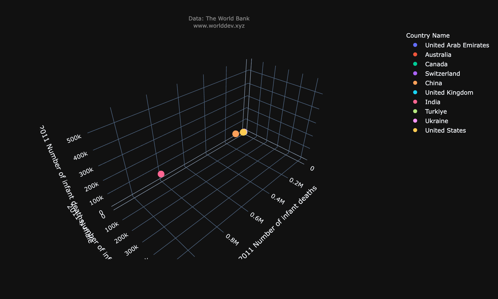
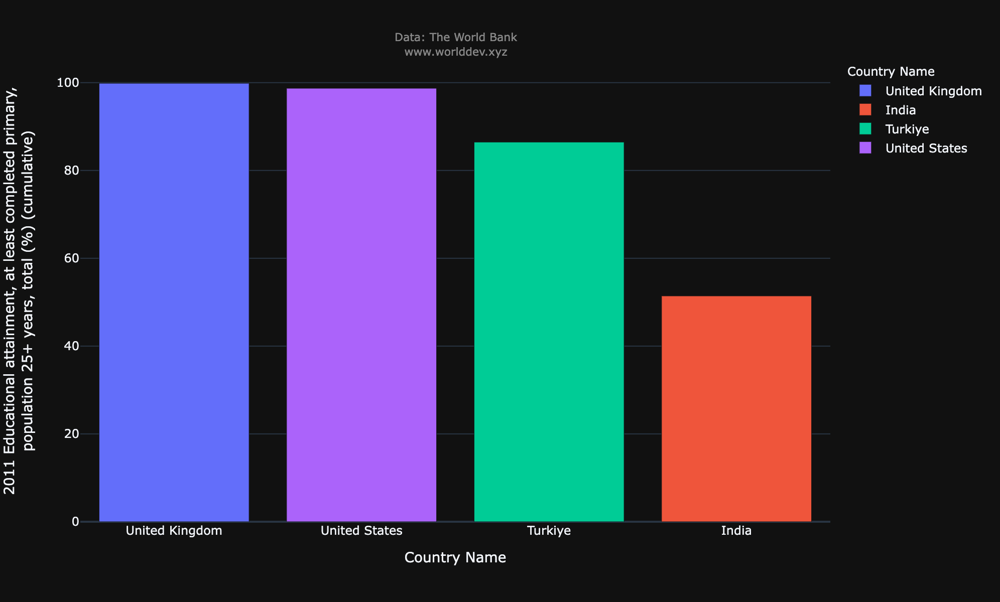
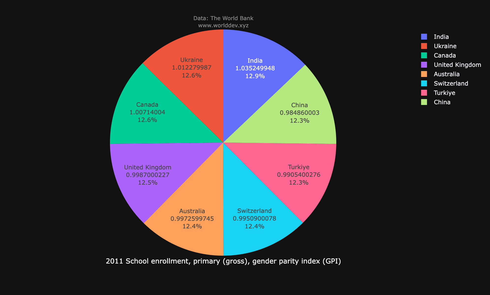
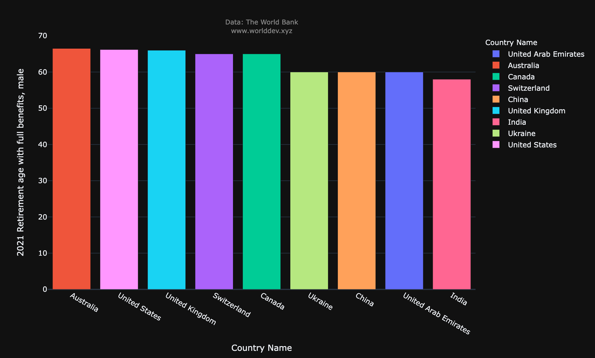
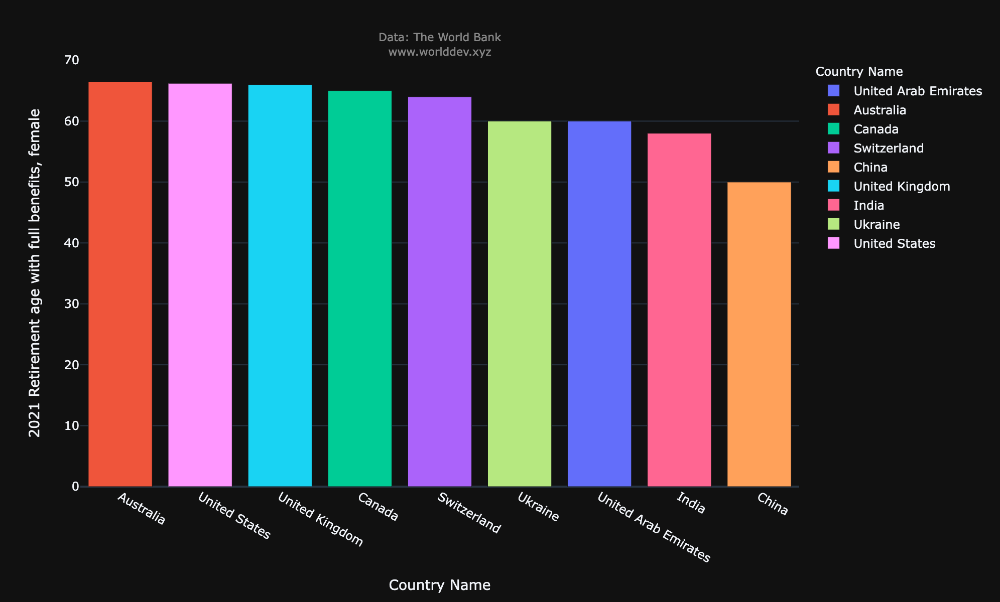
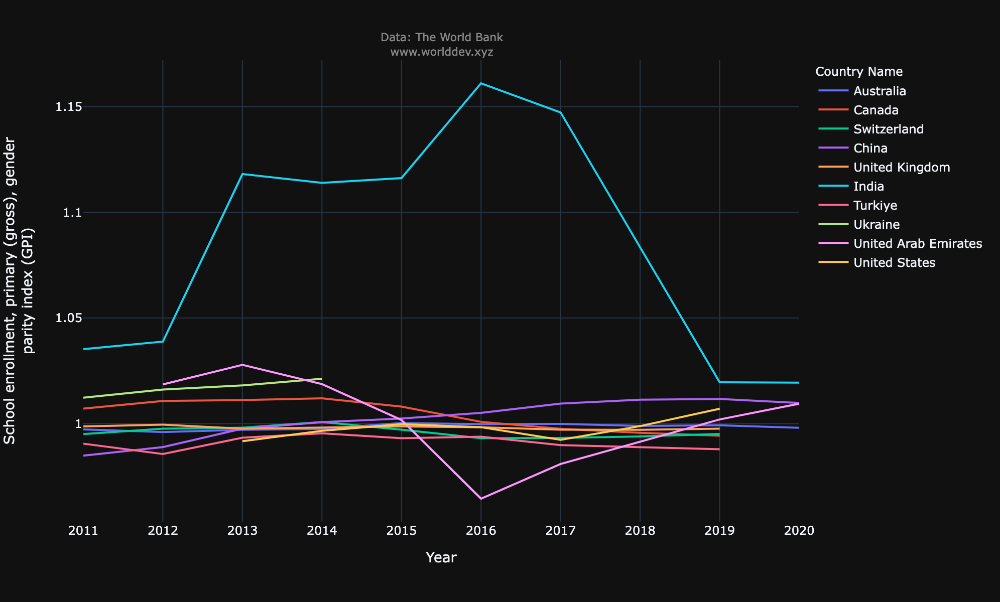
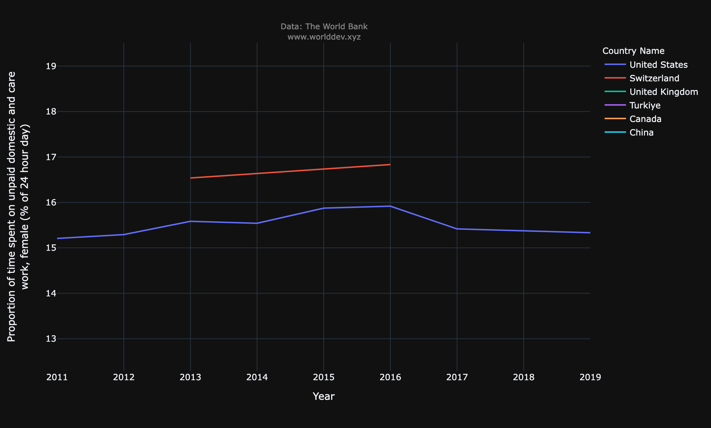
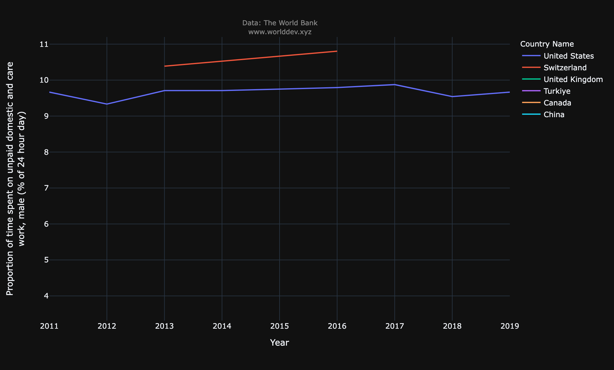
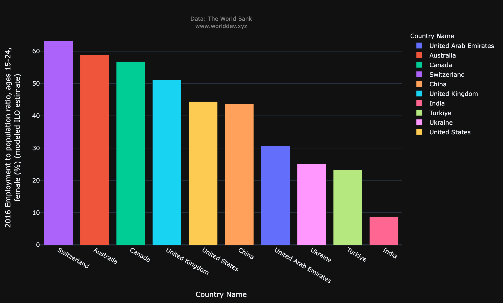
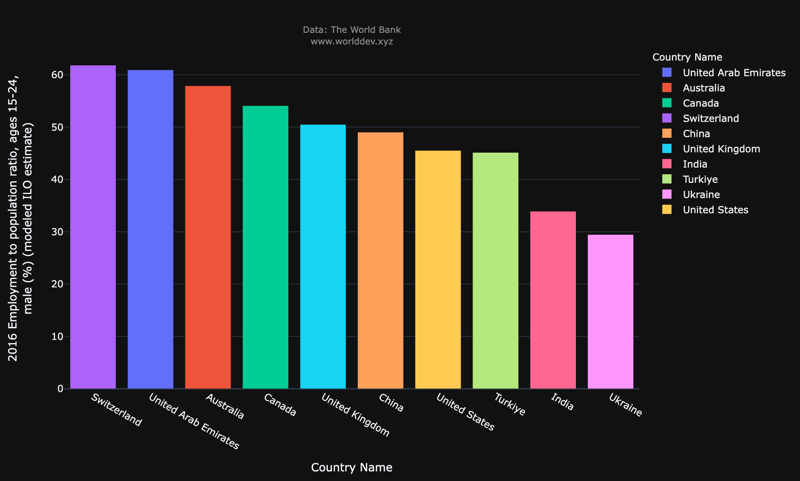

# *TOPIC: HEALTH AND GENDER* 

## INDICATORS:

 1. Literacy rate, youth (ages 15-24) gender parity index (GPI)
 2. School enrollment, primary (gross), gender parity index (GPI)
 3. Educational attainment, at least completed primary, population 25+ years, total (%) (cumulative)
 4. Retirement age with full benefits, female
 5. Retirement age with full benefits, male
 6. A woman can register a business in the same way as a man (1=yes; 0=no)
 7. Proportion of time spent on unpaid domestic and care work, female (% of 24 hour day)
 8. Proportion of time spent on unpaid domestic and care work, male (% of 24 hour day)
 9. Employment to population ratio, ages 15-24, female (%) (modeled ILO estimate)
 10. Employment to population ratio, ages 15-24, male (%) (modeled ILO estimate)
 11. Number of infant deaths, female
 12. Number of infant deaths, male
 13. Number of infant deaths
 14. Cause of death, by communicable diseases and maternal, prenatal a nd nutrition conditions (% of total)

## COUNTRIES:

  - INDIA
  - UAE
  - UNITED STATES
  - UKRAINE
  - TURKIYE
  - SWITZERLAND
  - CHINA
  - UNITED KINGDOM
  - AUSTRALIA
  - CANADA

## TIME SPAN:
 - 2011 - 2021

## INTRODUCTION:

#### WHY THIS TOPIC?
   - Gender equality is a core development objective in its own right. 
   - It is also smart development policy and sound business practice. It is integral to economic growth, business growth and good development outcomes. 
   - Gender equality can boost productivity, enhance prospects for the next generation, build resilience, and make institutions more representative and effective. 
   - I also wanted to look into the health sector, especially regarding female feticide which is one of the most disheartening things I’ve read in most of the articles when it comes to gender bias.

#### WHY THESE INDICATORS?
   - As i mentioned before i wanted to compare the number of infant deaths of female with male and its cause 
   - Next i wanted to compare the quality of education given to a girl child with the male child.
   - Later, i wanted to analyze if equal rights are given to both female and male employees during retirement.
   - I have also looked into the employment rate between men and women
   - Lastly, i have checked the time spent by both the genders on domestic work in the household.

### INFANT DEATHS RECORDED:
 - Feticide is one of the biggest crimes noted in countries like India , this helps us understand how many kids have died because of feticide.
 - In the below scatter plot we observe that it registered the most in India, irrespective of the gender though the reason is unkown here, the number of infant deaths is highest in India.

### EDUCATIONAL ATTAINMENT RATE BETWEEN DIFFERENT COUNTRIES:

  - Here we get to compare how different countries considered giving quality education to kids, especially female students between 2011 to 2021
  - we see that in the year 2011, UK had the highest education rate but in the year 2019 the US has the highest educational attainment.

   > education is not a problem but education is an opportunity.
   

### SCHOOL ENROLLMENT FOR KIDS IRRESPECTIVE OF THE GENDER:

   - This graph depicts how many students have enrolled into a school, i.e people who could afford and the countries which have taken a step to give education to as many students as possible 
   - In the graph it is seen that India has had the highest school enrollment rate back in 2011, whereas the other countries have been almost stationary.
   

### RETIREMENT BENEFITS:

  - It is absorved that there has been 'NO' difference in the retirement plan based on the gender which is really good, because irrespective of the gender people have given their best while working for an organization.
  - the pie charts show that Australia  has the highest percentage of benefits for its employees
  - I believe, retirement plans are very essential because it helps employees live a happy life and also encourages them to do better for a better tomorrow. 

  
  
  
  

### WOMEN REGISTERING FOR BUSINESS:

 - Women were considered Naive to maintain a business just like a man, but with time such stereotypes have been broken.
 - It is seen that UAE was the only country until 2016 to not have allowed women to register for a business just like how men did.
 - Lately, i.e by 2020, it is seen that all the selected countries have been giving equal importance to everyone irrespective of their gender .
 - It is also absorved that the India has been the first and has the highest rates in erolling women into business. 
   

### PERCENTAGE OF TIME SPENT ON DOMESTIC WORK :

 - I believe that Domestic or household work should be distributed equally among both the genders.
 - here, we get to analyze the amount of time spent by both the genders on household work.
 - It is observed that through time women and men are doing the household work for the same amount of time which is indeed very nice.
 
  
  

### EMPLOYEMENT RATE WITH RESPECT TO POPULATION:

  - Compared to the employement rate of men, women employement rate is low.
  - From the graph it is observed that Switzerland has the highest employement rate irrespective of the gender.
  - when it comes to gender we see that India has the least employement rate for women while Ukraine has the least employment rate for men.

  
  

### CONCLUSION:
 - I have always seen news on gender descrimination even before a girl child was born, so I wanted to see how a girls life has been compared to boys from birth. Through this explorer we get to see that female child deaths are high compared to male child deaths but gradually the number has been descreasing through years. Not just child birth but educational attainment, job enrollment, retirement plans and domestic work distribution between both genders has been changed a lot and we see that, most of the time both genders are given equal rights and pay and this change of giving equal importance to both the genders has taken a lot of time to be implemented.
